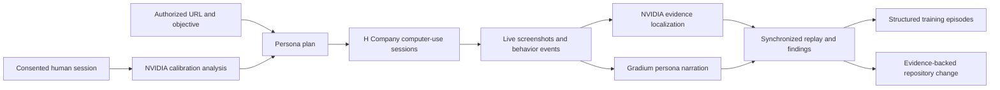

# GrannySmith

**A behavioral data engine for better AI interfaces.**

AI can generate an interface in seconds, but today’s models have little data showing how people actually struggle with those interfaces. GrannySmith sends human-calibrated computer-use agents through an authorized product, captures what they see and do, and turns every click, hesitation, misunderstanding, and recovery into a model-ready usability episode.

Built for the **H Company Computer Use Agents Hackathon 2026**.

## What GrannySmith does

1. **Describe the test** — provide an authorized product URL and a safe objective.
2. **Generate a panel** — create four product-specific personas, including a careful older adult with low digital confidence.
3. **Run real computer-use sessions** — H Company agents independently browse the product and stop before irreversible actions.
4. **Watch evidence arrive live** — narration, research, frustration signals, screenshots, cursor locations, and heatmaps appear during the run.
5. **Replay the experience** — review synchronized screen evidence, persona voice, heatmaps, and friction markers.
6. **Collect training episodes** — convert completed sessions into structured trajectories with outcome and friction labels.
7. **Prepare a fix safely** — connect a local repository, investigate the evidence, generate a scoped code change, and run validation checks without publishing automatically.

The immediate product is synthetic usability testing. The compounding asset is a behavioral dataset for training and evaluating future UI-generation and computer-use models.

## Why it is different

Traditional analytics show where users dropped off. GrannySmith records the full path around that failure:

```text
persona + objective
        ↓
screen observations + actions + think-aloud reactions
        ↓
misclicks + hesitation + backtracking + recovery
        ↓
structured trajectory + outcome labels + evidence-backed fix
```

Each collected episode includes the target task, persona context, ordered runtime events, coordinates, friction categories, completion outcome, safety status, recommendations, and usability score. Inline screenshots are represented by hashes in the dataset rather than copied as raw image data.

## Sponsor technology

- **H Company** — computer-use agent execution, session lifecycle, live trajectory evidence, and Holo-powered persona planning.
- **Gradium** — fast, persona-specific text-to-speech for synchronized think-aloud narration.
- **NVIDIA Nemotron / VSS** — visual judging, hotspot localization, and analysis of consented human calibration sessions.

The app also supports OpenAI models as an optional fallback for persona and screen-narration analysis.

## Human calibration

`/calibrate` records or uploads a consented usability session. GrannySmith validates the media, analyzes observable evidence with NVIDIA VSS or sampled-frame Nemotron analysis, and requires a human to review every extracted behavioral rule before approval.

An approved calibration becomes a reusable behavioral proxy that can join the same H Company testing panel. Raw calibration media and generated profiles are stored under the private `.grannysmith/` directory by default and are excluded from source control.

## Safe improvement workflow

GrannySmith can connect to a local Git repository through `GRANNYSMITH_REPO_PATH`. Repository metadata is exposed to the UI without revealing its absolute path. Fix agents receive one scoped usability recommendation and are instructed not to commit, push, publish, install packages, access credentials, or contact external services.

The improvement workflow returns:

- the proposed diff;
- validation commands and results;
- whether the change is ready for a human-reviewed pull request.

No change is published automatically.

## Architecture



## Quick start

### Requirements

- Node.js 20+
- pnpm 10+
- An H Company API key for real computer-use sessions

### Install and run

```bash
pnpm install
cp .env.example .env.local
pnpm dev
```

Open [http://localhost:3000](http://localhost:3000).

To run GrannySmith with the included demo product connected as the fix target:

```bash
pnpm dev:demo
pnpm dev:connected
```

The demo product uses its own development server; GrannySmith runs on port `3000`.

## Configuration

Real provider credentials belong in `.env.local`. Never commit API keys.

<!-- AUTO-GENERATED:ENVIRONMENT -->
| Variable | Required | Purpose |
|---|---:|---|
| `HAI_API_KEY` | For live runs | H Company API credential used to create and poll computer-use sessions. |
| `HAI_AGENTS_BASE_URL` | No | H Company agents API base URL. |
| `HAI_AGENT` | No | Computer-use agent identifier; defaults to `h/web-surfer-flash`. |
| `HAI_MODELS_BASE_URL` | No | H Company models API base URL. |
| `HAI_PERSONA_MODEL` | No | Holo model used for persona generation. |
| `GRANNYSMITH_PERSONA_MODE` | No | Overrides persona-generation routing. |
| `GRADIUM_API_KEY` | For live voice | Gradium API credential. |
| `GRADIUM_API_URL` | No | Gradium TTS endpoint. |
| `GRADIUM_OUTPUT_FORMAT` | No | Audio format; defaults to `wav`. |
| `GRADIUM_VOICE_ID` | No | Default Gradium voice. |
| `GRADIUM_VOICE_0` … `GRADIUM_VOICE_3` | No | Optional per-persona voice overrides. |
| `NVIDIA_API_KEY` | For NVIDIA analysis | NVIDIA API credential for Nemotron vision and hotspot analysis. |
| `NVIDIA_BASE_URL` | No | NVIDIA OpenAI-compatible endpoint. |
| `NVIDIA_MODEL` | No | NVIDIA visual-analysis model. |
| `NVIDIA_HEATMAP_MODEL` | No | NVIDIA model used for hotspot localization. |
| `NVIDIA_VSS_URL` | No | Optional NVIDIA VSS endpoint for full video-and-audio calibration analysis. |
| `NVIDIA_VSS_TOKEN` | No | Optional bearer token for the configured VSS service. |
| `OPENAI_API_KEY` | No | Optional fallback for persona, narration, and hotspot analysis. |
| `OPENAI_BASE_URL` | No | OpenAI API base URL. |
| `OPENAI_PERSONA_MODEL` | No | Persona-generation fallback model. |
| `OPENAI_HEATMAP_MODEL` | No | Hotspot-localization fallback model. |
| `GRANNYSMITH_REPO_PATH` | For code fixes | Absolute path to the authorized local repository or subdirectory. |
| `GRANNYSMITH_FIX_AGENT_MODE` | No | Set to `codex` to enable local fix investigation. |
| `GRANNYSMITH_FIX_JOB_FILE` | No | Storage path for durable proposal jobs. |
| `GRANNYSMITH_CALIBRATION_FILE` | No | Storage path for reviewed calibration profiles. |
| `GRANNYSMITH_CALIBRATION_MEDIA_DIR` | No | Private directory for calibration recordings. |
| `GRANNYSMITH_TRAINING_DATASET_FILE` | No | Storage path for collected training episodes; defaults to `.grannysmith/training-episodes.json`. |
| `NEMOCLAW_URL` | No | Optional managed endpoint for calibrated regression jobs. |
| `NEMOCLAW_TOKEN` | No | Optional credential for the configured NemoClaw endpoint. |
| `GRANNYSMITH_NEMOCLAW_JOB_FILE` | No | Local fallback storage for NemoClaw jobs. |
<!-- /AUTO-GENERATED:ENVIRONMENT -->

The app remains usable with deterministic local fallbacks when optional providers are absent. It does not substitute fake evidence for failed live H Company sessions.

## Commands

<!-- AUTO-GENERATED:SCRIPTS -->
| Command | Description |
|---|---|
| `pnpm dev` | Start GrannySmith in development mode. |
| `pnpm dev:connected` | Start GrannySmith on port 3000 with the included demo repository connected for fixes. |
| `pnpm dev:demo` | Start the included demo product. |
| `pnpm build` | Create a production build. |
| `pnpm start` | Start the production server. |
| `pnpm lint` | Run ESLint. |
| `pnpm typecheck` | Run TypeScript without emitting files. |
| `pnpm test` | Run the Vitest suite once. |
| `pnpm test:watch` | Run Vitest in watch mode. |
| `pnpm test:coverage` | Run tests with V8 coverage. |
| `pnpm test:e2e` | Run Playwright end-to-end tests. |
<!-- /AUTO-GENERATED:SCRIPTS -->

## Safety and data boundaries

- Only test products you own or have permission to evaluate.
- Agent objectives include explicit stop conditions before purchases, payments, credential entry, private-data submission, or other irreversible actions.
- Human calibration requires affirmative consent and separate research-use confirmation.
- Calibration uploads are type checked, size limited, rate limited, and same-origin protected.
- Training episodes are collected only from completed report runs.
- Local repository changes remain uncommitted and unpublished until a human reviews them.

## Built with

Next.js 15, React 19, TypeScript, Zustand, Zod, Motion, Three.js, Vitest, Testing Library, and Playwright.
